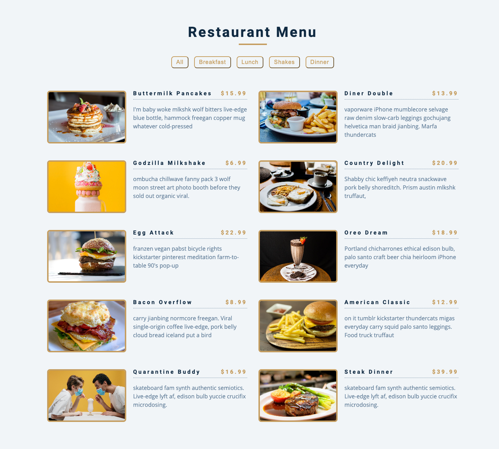

# Restaurant Menu

Dynamic Restaurant Menu app in javascript.

# Guideline

- Create your team if you don't have already and fork this project.
- Add all team members as collaborators to the forked project.
- Every task should have it's own branch name.
- You should create pull requests into your team's branch.
- Each pull request suppose to have a deployed version of code.
- Make sure that your code is reusable and maintainable.
- Follow this code review checklist [link](https://gist.github.com/maratgaip/6182ca1c1d9ec3614e912b7165338570).
- You can deploy to these websites:
  1. Netlify. [Netflify](https://www.netlify.com/) , [Blog](https://www.netlify.com/blog/2016/09/29/a-step-by-step-guide-deploying-on-netlify/)
  2. [Surge](https://surge.sh/)
  3. [Github](https://pages.github.com/)

# Tasks

1. Define points for each task add into your readme file. [Issue #5](https://github.com/seytechschool/restaurant-menu/issues/5) - 1 point;
2. Render data [Issue #1](https://github.com/seytechschool/restaurant-menu/issues/1). [Api Url](https://gist.githubusercontent.com/maratgaip/44060c688fcf5f2b7b3985a6d15fdb1d/raw/e93c3dce0826d08c8c6e779cb5e6d9512c8fdced/restaurant-menu.json) - 5 points;
3. Render menu [Issue #2](https://github.com/seytechschool/restaurant-menu/issues/2) - 3 points;
4. Show Active menu [Issue #6](https://github.com/seytechschool/restaurant-menu/issues/6) - 1 points;
5. Filter functionality [Issue #3](https://github.com/seytechschool/restaurant-menu/issues/3) - 3 points;
6. Search functionality [Issue #4](https://github.com/seytechschool/restaurant-menu/issues/4) - 3 points;
7. Search by feature. [Issue #7](https://github.com/seytechschool/restaurant-menu/issues/7) - 3 points;
8. Filter by price feature. [Issue #8](https://github.com/seytechschool/restaurant-menu/issues/8) - 3 points;
9. Add to card feature. [Issue #9](https://github.com/seytechschool/restaurant-menu/issues/9) - 5 points;

# Screenshot

